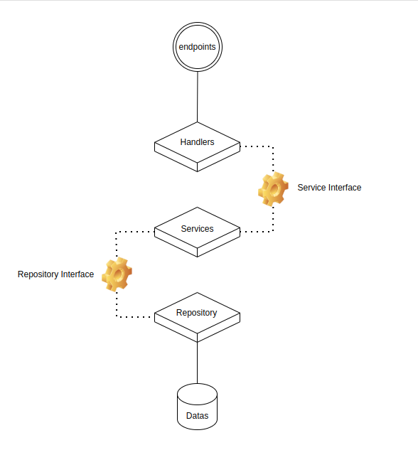

# Go Easyway - Project Template

This repository is a simple, easy-to-follow template for setting up a Go project. It provides a clean structure to help developers organize code, manage dependencies, and build robust applications.

## Features
- **Modular project structure**: Clearly defined layers and packages to separate concerns and ensure maintainability.
- **Dependency management**: Leverages Go Modules to manage dependencies.
- **Configuration**: Handles environment-based configurations and settings.
- **Logging**: Preconfigured logging setup using a customizable logger.
- **Docker support**: A `Dockerfile` for containerization.

## Architecture



## Project Structure

Here’s the project structure:

```plaintext
go-easyway/
├── cmd/                   # Application Setup
├── config/
│   └── config.go          # Configuration setup for different environments
├── domain/                # Domain models and business logic
├── pkg/   
├── Dockerfile             # Docker configuration for containerization
├── go.mod                 # Go module definition
├── go.sum                 # Go dependencies lockfile
├── README.md              # Project documentation
├── .env                   # Environment variables for local development
└── tests/
    └── api_test.go        # Example of a basic API test
```

## How to Use

1. **Clone the repository**:
   ```bash
   git clone https://github.com/jubarodrigo/go-easyway.git
   ```

2. **Install dependencies**:
   ```bash
   go mod download
   ```

3. **Run the application**:
   ```bash
   go run main.go
   ```

4. **Run tests**:
   Execute the tests using:
   ```bash
   go test ./...
   ```

5. **Build the Docker image**:
   Build the Docker image with:
   ```bash
   docker build -t go-easyway .
   ```

## Customizing

- **Handlers**: Define the API logic and request handling inside `apiserver`.
- **Domain**: Add domain-specific logic and models inside `domain`.
- **Configuration**: Update or extend the environment-based settings in `config/config.go`.

## Contributions

Feel free to fork this template, submit issues, or create pull requests to improve it!

---
